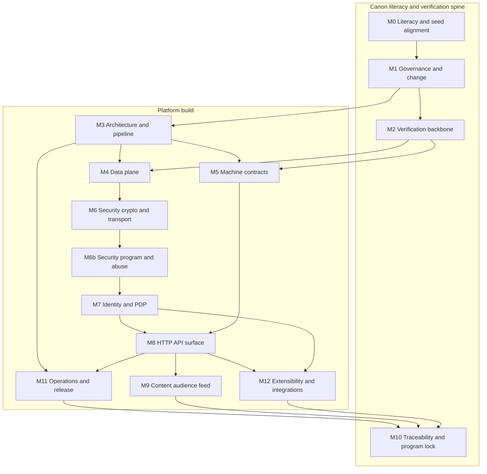

# CRE8 platform implementation milestones & slices (SSOT-guided)

_Last updated (UTC): 2026-05-05_

## Purpose & location

This document is the primary **engineering delivery roadmap** for building a **production-ready** CRE8 platform that:

1. **Implements normative behavior exclusively from `docs/`** (per [`docs/00_governance/SSOT_INDEX.md`](../docs/00_governance/SSOT_INDEX.md): `README.md` → `docs/` → informational `reports/`).
2. **Honors `/seed` as provenance and redesign intent** without reintroducing assumptions explicitly **dropped** or **redesigned** in [`seed/CRE8_SEED_PRESERVATION_MATRIX.md`](../seed/CRE8_SEED_PRESERVATION_MATRIX.md) and the seed index [`seed/seed-index.md`](../seed/seed-index.md) / [`seed/CRE8_SEED_CANON_INDEX.md`](../seed/CRE8_SEED_CANON_INDEX.md). When `seed/` and `docs/` disagree on behavior, **`docs/` wins** unless governance promotes an exception with a recorded decision.
3. **Stays aligned with the full implementer syllabus** [`dev/SSOT_CANON_READING_LIST.md`](./SSOT_CANON_READING_LIST.md)—this roadmap is **development planning**, not product SSOT.

**Relocation:** [`reports/IMPLEMENTATION_MILESTONES_DEV_RELOCATION_NOTE_2026-05-05.md`](../reports/IMPLEMENTATION_MILESTONES_DEV_RELOCATION_NOTE_2026-05-05.md).

**Structural / reference hygiene:** Any change that adds, moves, renames, or removes repository files **MUST** follow [`REFERENCE_MAINTENANCE_SOP.md`](../REFERENCE_MAINTENANCE_SOP.md) (`FILE_INVENTORY.md` → `master_index.md` → local indexes, link validation, verification).

---

## Normative engineering anchors (non-negotiable)

| Anchor | Role |
|--------|------|
| [`docs/10_product_and_architecture/REQUEST_PIPELINE_AND_MIDDLEWARE_CONTRACT.md`](../docs/10_product_and_architecture/REQUEST_PIPELINE_AND_MIDDLEWARE_CONTRACT.md) | PDP/middleware ordering; handlers **MUST NOT** re-adjudicate authorization outcomes. |
| [`docs/20_identity_delegation_and_policy/AUTHORIZATION_AND_DELEGATION_SPEC.md`](../docs/20_identity_delegation_and_policy/AUTHORIZATION_AND_DELEGATION_SPEC.md) + [`AUTHORIZATION_DECISION_TABLES.md`](../docs/20_identity_delegation_and_policy/AUTHORIZATION_DECISION_TABLES.md) | Evaluation order and deny precedence (ADR-005). |
| [`docs/30_contracts_and_interfaces/API_CONTRACT_GUIDE.md`](../docs/30_contracts_and_interfaces/API_CONTRACT_GUIDE.md) + [`ERROR_CODE_CATALOG.md`](../docs/30_contracts_and_interfaces/ERROR_CODE_CATALOG.md) | Envelopes, deterministic errors, redaction. |
| [`docs/31_machine_contracts/`](../docs/31_machine_contracts/README.md) | OpenAPI + JSON Schemas + [`PROSE_OPENAPI_PARITY_TABLE.md`](../docs/31_machine_contracts/PROSE_OPENAPI_PARITY_TABLE.md) parity. |
| [`docs/80_traceability_decisions_and_program/TRACEABILITY_MATRIX.md`](../docs/80_traceability_decisions_and_program/TRACEABILITY_MATRIX.md) | Requirement ↔ hook ↔ evidence for behavioral changes. |
| **ADR-006** ([`records/ADR-006-phase4-program-lock-and-legacy-waiver-retirement.md`](../docs/80_traceability_decisions_and_program/records/ADR-006-phase4-program-lock-and-legacy-waiver-retirement.md)) | Program-lock posture: legacy Phase 1 waiver mechanics **MUST NOT** be reused as generic deferrals; bounded exceptions require explicit governance. |

---

## Program topology (dependency order)

Milestones are **partial orders**: some work runs in **parallel** (e.g. observability bootstrap with early routes; machine-contract lint with architecture).

### Recommended hard gates

1. **M1** complete before sustained implementation without **change class**, **trace rows**, and **impact maps** where required by [`CONTRIBUTION_WORKFLOW_SSOT.md`](../docs/00_governance/CONTRIBUTION_WORKFLOW_SSOT.md).
2. **M3** middleware/pipeline contracts fixed before widening route handlers (no PDP outcome branching in handlers).
3. **M5** route/schema/example parity baseline **green** before declaring **M8** API families complete for merge to main.
4. **M7** PDP semantics, permission vocabulary, and decision tables **stable** before broad route completion.
5. **M6 + M6b** security crypto **and** threat/control/abuse posture reflected in tests and runtime before production promotion.
6. **M10** program lock: **`composer phase3:final-acceptance-bundle`**, **`docs/ssot/coverage_latest.json`** with `untraced_requirements == 0` where CI enforces it, **RG-01..RG-05** evidence per [`RELEASE_CHECKLIST.md`](../docs/60_operations_quality_and_release/RELEASE_CHECKLIST.md), and seed/gap trackers consistent with **ADR-006**.

---

## Milestones (outcomes)

| ID | Milestone | Outcome (production-ready bar) |
|----|-----------|--------------------------------|
| **M0** | Canon literacy, seed alignment, toolchain | Team navigates `README` → `docs/` hub → `SSOT_INDEX`; reads **`seed/seed-index.md`** and preservation matrix; runs Composer SSOT scripts; classifies PR **change class** |
| **M1** | Governance / change spine | `CONTRIBUTION_WORKFLOW_SSOT`, `CHANGE_CONTROL_POLICY`, `DEFINITION_OF_DONE`, `CROSS_DOCUMENT_LINKING_POLICY`; metadata on normative doc edits; **change impact maps** for contract/security changes per [`CHANGE_IMPACT_MAP_TEMPLATES.md`](../docs/80_traceability_decisions_and_program/CHANGE_IMPACT_MAP_TEMPLATES.md) |
| **M2** | Verification backbone | `TRACEABILITY_MATRIX`, `VERIFICATION_STRATEGY`, `SSOT_AUTOMATION_AND_LINTING`; CI **`docs:ssot:*`** and contract tests non-optional; **`composer phase2:acceptance-bundle`** baseline; **`composer phase3:final-acceptance-bundle`** as merge gate |
| **M3** | Architectural runtime spine | `DEPENDENCY_BASELINE`, `MODULE_BOUNDARIES_AND_OWNERSHIP`, `ARCHITECTURE_AND_SURFACES`, `REQUEST_PIPELINE_AND_MIDDLEWARE_CONTRACT`, `CRE8_PRODUCT_AND_SYSTEM_SPEC`, `ID_UTILITY_KEYPAIR_MODEL_SPEC`, `CANONICAL_TERMINOLOGY`—runtime matches documented surfaces and pipeline |
| **M4** | Data plane | `DATA_MODEL_SPEC`, `DATA_MODEL_REFERENCE`, `ERD` ↔ migrations; sensitivity and classification from data specs; **`MIGRATION_AND_SEED_STRATEGY`** + forward-only discipline |
| **M5** | Machine-contract substrate | `ROUTE_INVENTORY_REFERENCE` ↔ `openapi/cre8.v1.yaml` ↔ `schemas/*.schema.json` ↔ `PROSE_OPENAPI_PARITY_TABLE`; `CONTRACT_VERSION_POLICY`; deprecation and compat hooks |
| **M6** | Cryptography and key lifecycle | `CRYPTO_PROFILE`, `KEY_LIFECYCLE_AND_CRYPTOGRAPHY_SPEC` operational in code; `SECURITY_HEADERS_AND_CSP_POLICY` on HTTP/HTML surfaces |
| **M6b** | Security program (threats, controls, abuse) | `SECURITY_THREAT_MODEL`, `SECURITY_CONTROLS_SPEC`, `SECURITY_VERIFICATION_ABUSE_CASES` drive tests/config; controls mapped to observable outcomes and errors |
| **M7** | Identity, PDP, delegation, keychain | `PRINCIPAL_TYPES_AND_CAPABILITY_MATRIX`, `PERMISSION_VOCABULARY`, `AUTHORIZATION_AND_DELEGATION_SPEC`, `AUTHORIZATION_DECISION_TABLES`, `KEYCHAIN_COMPOSITION_AND_RESOLUTION_SPEC`, `DELEGATION_STATE_MACHINE`, `USAGE_SCENARIOS_AND_PERMISSION_STORIES`—executable fixtures |
| **M8** | HTTP API breadth | All `ROUTE_INVENTORY_REFERENCE` behaviors, envelopes, `ERROR_CODE_CATALOG`; `API_CONTRACT_GUIDE`; `Endpoint_Examples_All_Routes` ↔ tests; negative and redaction coverage |
| **M9** | Content, audience, feed, interactions | `CONTENT_MODEL_AND_TARGETING_SPEC`, `AUDIENCE_GROUP_SPEC`, `FEED_RANKING_AND_ORDERING_RULES`, `COMMENTING_AND_INTERACTION_POLICY`—deterministic feed, moderation, deny semantics |
| **M10** | Traceability, evidence, program lock | Matrix closure; `ADR_INDEX`, `DECISIONS_LOG`, `RISK_REGISTER`; `SEED_PROMOTION_TRACKER`, `UNRESOLVED_SEED_GAP_REGISTER`; `docs/evidence` templates satisfied for RG gates |
| **M11** | Operations, observability, release | `HEALTH_ENDPOINT_CONTRACT`, `BOOT_AND_STARTUP_FAILURE_CONTRACT`, `CONFIGURATION_ENVIRONMENT_CONTRACT`, `OPERATIONAL_SMOKE_CHECK_CONTRACT`, `OBSERVABILITY_EVENT_CATALOG`, `RELEASE_CHECKLIST`, `PRODUCTION_READINESS_GATES`, `SLO_SLI_SPEC`, `ACCEPTANCE_CRITERIA_MATRIX` |
| **M12** | Extensibility and integrations | `EXTENSIBILITY_PLAYBOOK`, `POST_TYPE_EXTENSION_SPEC`, `PRINCIPAL_TYPE_EXTENSION_SPEC`, `INTEGRATION_PROVIDER_PATTERN`, `WEBHOOK_AND_INTEGRATION_CONTRACT`—non-overridable core invariants preserved |

---

## Slices per milestone

Each slice lists: **objective**, **entry**, **exit**, **canon anchors** (by `docs/` path or reading-list §), **verification hooks** (`composer` / CI).

### M0 — Canon literacy, seed alignment, toolchain

| Slice ID | Objective | Entry | Exit | Canon anchors | Verification hooks |
|----------|-----------|--------|------|---------------|-------------------|
| S0.1 | Repository precedence | Clone + [`README.md`](../README.md) | Written team note: precedence; `reports/` non-normative unless promoted | Reading list §1 | `composer validate --strict` |
| S0.2 | Governance path | S0.1 | Onboarding doc links to `docs/00_governance/*` | Reading list §2 | `composer docs:ssot:lint` |
| S0.3 | Seed provenance | S0.1 | **ID-keypair-first**, delegation bounds, dropped assumptions understood | [`seed/seed-index.md`](../seed/seed-index.md), [`CRE8_SEED_CANON_INDEX.md`](../seed/CRE8_SEED_CANON_INDEX.md), [`CRE8_SEED_PRESERVATION_MATRIX.md`](../seed/CRE8_SEED_PRESERVATION_MATRIX.md) | Seed gap script when used: `composer docs:ssot:seed-gap-schema` |
| S0.4 | SSOT toolchain rehearsal | S0.2 | Local run: lint, sync-check, report | Reading list §13; [`composer.json`](../composer.json) | `composer docs:ssot:lint`, `composer docs:ssot:sync-check`, `composer docs:ssot:report` |
| S0.5 | WG operating model | S0.2 | Owners/reviewers per [`DOCUMENT_STATUS_AND_OWNERSHIP.md`](../docs/00_governance/DOCUMENT_STATUS_AND_OWNERSHIP.md); handoff discipline per [`CRE8_HUMAN_OPERATING_MODEL.md`](../docs/10_product_and_architecture/CRE8_HUMAN_OPERATING_MODEL.md) | Reading list §2–3 | `composer docs:ssot:review-gate-check` (on doc PRs) |

### M1 — Governance / change

| Slice ID | Objective | Entry | Exit | Canon anchors | Hooks |
|----------|-----------|--------|------|---------------|-------|
| S1.1 | PR change class | M0 | Checklist: contract-/security-/governance-/editorial | `CONTRIBUTION_WORKFLOW_SSOT`, `CHANGE_CONTROL_POLICY` | `composer docs:ssot:pr-evidence-check` |
| S1.2 | Metadata and style | M0 | Pilot normative doc passes template | `DOCUMENT_TEMPLATE_AND_STYLE_GUIDE` | `composer docs:ssot:lint` |
| S1.3 | Reachability | S1.2 | No orphaned normative hubs | `SSOT_INDEX`, `CROSS_DOCUMENT_LINKING_POLICY` | `composer docs:ssot:lint` |
| S1.4 | Change impact discipline | S1.1 | Engineers use CIM for contract/security-impacting `src/` changes | `CHANGE_IMPACT_MAP_TEMPLATES`, `DEFINITION_OF_DONE` | Manual + `composer docs:ssot:dod-trace-check` where registered |

### M2 — Verification backbone

| Slice ID | Objective | Entry | Exit | Canon anchors | Hooks |
|----------|-----------|--------|------|---------------|-------|
| S2.1 | Trace mechanics | M1 | New/changed reqs have matrix rows REQ ↔ HOOK ↔ evidence | `TRACEABILITY_MATRIX`, `VERIFICATION_STRATEGY` | `composer docs:ssot:report` |
| S2.2 | Hook registry | S2.1 | Executable hooks mapped in `composer.json` per `SSOT_AUTOMATION_AND_LINTING` | `SSOT_AUTOMATION_AND_LINTING` | CI workflow [`.github/workflows/ssot_phase_gate.yml`](../.github/workflows/ssot_phase_gate.yml) |
| S2.3 | Phase 2 bundle baseline | S2.1 | Legacy/baseline acceptance green | `PHASE2_ACCEPTANCE_CRITERIA`, `PHASE2_UNRESOLVED_EXCEPTIONS_REGISTER` | `composer phase2:acceptance-bundle` |
| S2.4 | Phase 3 merge gate | Commands available | RG-04 readiness on branch | `RELEASE_CHECKLIST` | `composer phase3:final-acceptance-bundle` |
| S2.5 | Drift pack (maintenance) | S2.4 | Scheduled or pre-promotion drift check | `SSOT_AUTOMATION_AND_LINTING` | `composer docs:ssot:phase3-drift-pack` |

### M3 — Architecture / pipeline / product anchors

| Slice ID | Objective | Entry | Exit | Canon anchors | Hooks |
|----------|-----------|--------|------|---------------|-------|
| S3.1 | Composition root | M2 | DI/modules match baseline | `DEPENDENCY_BASELINE`, `MODULE_BOUNDARIES_AND_OWNERSHIP` | Smoke + lint |
| S3.2 | Product and key model | S3.1 | Runtime invariants match product + ID/utility model | `CRE8_PRODUCT_AND_SYSTEM_SPEC`, `ID_UTILITY_KEYPAIR_MODEL_SPEC` | Contract tests as available |
| S3.3 | Middleware order | S3.2 | Central envelopes; **no handler PDP branching** | `REQUEST_PIPELINE_AND_MIDDLEWARE_CONTRACT`, `ARCHITECTURE_AND_SURFACES` | `composer test:contract:auth` (ordering), custom ordering tests |
| S3.4 | Cross-cutting infrastructure | S3.3 | Rate limit, CORS, logging per baseline and pipeline | `DEPENDENCY_BASELINE`, `REQUEST_PIPELINE_AND_MIDDLEWARE_CONTRACT` | Integration tests |
| S3.5 | Surface topology | S3.3 | Route groups ↔ Owner Console / API Gateway / public surface | `ARCHITECTURE_AND_SURFACES`, `ROUTE_INVENTORY_REFERENCE` (prelude) | `composer docs:ssot:route-uniqueness` |
| S3.6 | Glossary enforcement | S3.1 | Implementation vocabulary aligns with canonical terms | `CANONICAL_TERMINOLOGY` | `composer docs:ssot:glossary-check` |

### M4 — Data plane

| Slice ID | Objective | Entry | Exit | Canon anchors | Hooks |
|----------|-----------|--------|------|---------------|-------|
| S4.1 | Entities and constraints | **M3** | Schema ↔ `DATA_MODEL_SPEC`, `DATA_MODEL_REFERENCE`, `ERD` | `docs/40_data_security_and_crypto/DATA_MODEL_SPEC.md`, `DATA_MODEL_REFERENCE.md`, `ERD.md` | `composer docs:ssot:data-model-coverage`; migration tests |
| S4.2 | Seeds and environments | S4.1 | baseline/test/demo gating | `MIGRATION_AND_SEED_STRATEGY`, `CONFIGURATION_ENVIRONMENT_CONTRACT` | `composer ops:migrate-smoke` (env-gated) |

### M5 — Machine contracts

| Slice ID | Objective | Entry | Exit | Canon anchors | Hooks |
|----------|-----------|--------|------|---------------|-------|
| S5.1 | Route ↔ OpenAPI parity | **M3** | Full inventory parity | `ROUTE_INVENTORY_REFERENCE`, `openapi/cre8.v1.yaml`, `PROSE_OPENAPI_PARITY_TABLE` | `composer docs:ssot:route-parity` |
| S5.2 | OpenAPI structure | S5.1 | Authz requestBody and structural rules | `openapi/cre8.v1.yaml` | `composer docs:ssot:openapi-lint` |
| S5.3 | Schema closure | S5.2 | JSON Schemas match guides; object closure | `schemas/*.schema.json`, `API_CONTRACT_GUIDE` | `composer docs:ssot:schema-coverage` |
| S5.4 | Examples coverage | S5.3 | Examples enumerated and validated | `Endpoint_Examples_All_Routes`, schemas | `composer docs:ssot:example-coverage` |
| S5.5 | Versioning and deprecation | S5.4 | Semver, compat, deprecations explicit | `CONTRACT_VERSION_POLICY` | `composer docs:ssot:deprecation-schema` |
| S5.6 | Source refs integrity | S5.1 | Doc seed refs resolve | Normative `source_seed_refs` | `composer docs:ssot:source-refs-check` |

### M6 — Cryptography and key lifecycle

| Slice ID | Objective | Entry | Exit | Canon anchors | Hooks |
|----------|-----------|--------|------|---------------|-------|
| S6.1 | Crypto profile | **M4** | Algorithms, nonces, skew per profile | `CRYPTO_PROFILE`, `KEY_LIFECYCLE_AND_CRYPTOGRAPHY_SPEC` | `composer test:contract:identity-issuance`, security tests |
| S6.2 | Key lifecycle | S6.1 | suspend/revoke/rotate semantics | `KEY_LIFECYCLE_AND_CRYPTOGRAPHY_SPEC` | `composer test:contract:lifecycle` |
| S6.3 | HTTP security headers | S6.1 | Headers/CSP per surface | `SECURITY_HEADERS_AND_CSP_POLICY` | Header integration tests |

### M6b — Security program (threats, controls, abuse)

| Slice ID | Objective | Entry | Exit | Canon anchors | Hooks |
|----------|-----------|--------|------|---------------|-------|
| S6b.1 | Threat–control mapping | **M6** | THREAT-* ↔ SEC-CTRL-* implemented | `SECURITY_THREAT_MODEL`, `SECURITY_CONTROLS_SPEC` | `composer docs:ssot:threat-control-matrix` |
| S6b.2 | Abuse cases | S6b.1 | ABUSE-* scenarios attestable | `SECURITY_VERIFICATION_ABUSE_CASES` | Security/`abuse` regression tests |
| S6b.3 | Error and observability linkage | S6b.1 | Deny codes and events match catalog | `ERROR_CODE_CATALOG`, `OBSERVABILITY_EVENT_CATALOG` | Contract + log fixtures |

### M7 — Identity / authorization / delegation

| Slice ID | Objective | Entry | Exit | Canon anchors | Hooks |
|----------|-----------|--------|------|---------------|-------|
| S7.1 | Principals and permissions | **M6b** | Taxonomy + unknown-token deny | `PRINCIPAL_TYPES_AND_CAPABILITY_MATRIX`, `PERMISSION_VOCABULARY` | `composer docs:ssot:permission-vocab-resolve`, `composer docs:ssot:capability-matrix-complete` |
| S7.2 | Auth proofs and route auth models | S7.1 | Route `auth_models` honored | `ROUTE_INVENTORY_REFERENCE`, `KEY_LIFECYCLE_AND_CRYPTOGRAPHY_SPEC` | `composer test:contract:auth` |
| S7.3 | PDP evaluation order | S7.2 | Seven-gate order + precedence (ADR-005) | `AUTHORIZATION_AND_DELEGATION_SPEC`, `AUTHORIZATION_DECISION_TABLES` | `composer test:contract:auth-reasons` |
| S7.4 | Keychain resolution | S7.3 | Deterministic grant walk | `KEYCHAIN_COMPOSITION_AND_RESOLUTION_SPEC` | Targeted tests |
| S7.5 | Delegation state machine | S7.4 | Transitions + cascade | `DELEGATION_STATE_MACHINE`, `USAGE_SCENARIOS_AND_PERMISSION_STORIES` | `composer docs:ssot:delegation-sm-consistency`; scenario tests |

### M8 — HTTP API surface clusters

| Slice ID | Objective | Entry | Exit | Canon anchors | Hooks |
|----------|-----------|--------|------|---------------|-------|
| S8.1 | AuthZ routes | **M7**, **M5** | Auth family complete + deterministic denies | `ROUTE_INVENTORY_REFERENCE`, `ERROR_CODE_CATALOG` | `composer test:contract:auth` |
| S8.2 | Identity issuance/context | S8.1 | OpenAPI + schemas | `openapi`, schemas | `composer test:contract:identity-issuance`, `composer test:contract:identity-context` |
| S8.3 | Lifecycle routes | S8.2 | suspend/revoke fixtures | Lifecycle schemas | `composer test:contract:lifecycle` |
| S8.4 | Feed routes | S8.2 | Ordering + deny matrix | `FEED_RANKING_AND_ORDERING_RULES`, `COMMENTING_AND_INTERACTION_POLICY` | `composer test:contract:feed` |
| S8.5 | Error catalog and redaction | S8.1 | All public errors mapped; no secret leakage | `ERROR_CODE_CATALOG` | `composer test:contract:error`, `composer test:contract:error-secrets` |
| S8.6 | Request/response schemas | S5 | Examples validate | Schemas, `API_CONTRACT_GUIDE` | `composer test:contract:request-schema`, `composer test:contract:response-schema` |
| S8.7 | Examples sweep | S8.* | `Endpoint_Examples_All_Routes` coverage | `Endpoint_Examples_All_Routes` | Per-route negatives |
| S8.8 | UI/runtime parity | S8.* | Exception class bounded per surface | `UI_RUNTIME_CONTRACT` | `composer test:contract:surface-parity` |

### M9 — Content / audience / feed / interactions

| Slice ID | Objective | Entry | Exit | Canon anchors | Hooks |
|----------|-----------|--------|------|---------------|-------|
| S9.1 | Audience groups | **M4**, **M7** | Lifecycle + permissions | `AUDIENCE_GROUP_SPEC` | Integration tests |
| S9.2 | Content model and targeting | S9.1 | visibility_scope, soft-delete, moderation states | `CONTENT_MODEL_AND_TARGETING_SPEC` | Targeting tests |
| S9.3 | Feed determinism | S9.2 | Newest-first, tie-break, cursor/pagination | `FEED_RANKING_AND_ORDERING_RULES` | `composer test:contract:feed` |
| S9.4 | Comments and moderation | S9.3 | Branch order + deny codes + audit/provenance | `COMMENTING_AND_INTERACTION_POLICY` | Feed/interaction suites |
| S9.5 | Cross-domain auth denies | S9.* | Feed/interaction denies ↔ `ERROR_CODE_CATALOG` | `ERROR_CODE_CATALOG`, `AUTHORIZATION_DECISION_TABLES` | Contract tests |

### M11 — Operations / observability / release

| Slice ID | Objective | Entry | Exit | Canon anchors | Hooks |
|----------|-----------|--------|------|---------------|-------|
| S11.1 | Health and boot | **M3** | READY vs LIVE; startup failures explicit | `HEALTH_ENDPOINT_CONTRACT`, `BOOT_AND_STARTUP_FAILURE_CONTRACT` | `composer ops:health-smoke` |
| S11.2 | Configuration | M3 | Env contract + secrets hygiene | `CONFIGURATION_ENVIRONMENT_CONTRACT` | Config validation tests |
| S11.3 | Observability (bootstrap) | **M8** early | Critical routes emit catalog events | `OBSERVABILITY_EVENT_CATALOG` | `composer docs:ssot:event-catalog-coverage`; log checks |
| S11.4 | Observability (complete) | S11.3 | All mandated decision/security events | `OBSERVABILITY_EVENT_CATALOG`, `SECURITY_CONTROLS_SPEC` | Staging log audits |
| S11.5 | Smoke and migration ops | M4 | Operational smoke + migrate smoke | `OPERATIONAL_SMOKE_CHECK_CONTRACT`, `MIGRATION_AND_SEED_STRATEGY` | `composer ops:migrate-smoke`, smoke scripts |
| S11.6 | SLO/SLI and readiness | Near lock | SLOs measured; gates pass | `SLO_SLI_SPEC`, `PRODUCTION_READINESS_GATES`, `ACCEPTANCE_CRITERIA_MATRIX` | RG evidence |
| S11.7 | Release checklist | S11.6 | RG-01..RG-05 artifacts | `RELEASE_CHECKLIST` | `composer phase3:final-acceptance-bundle` |

### M12 — Extensibility / integrations

| Slice ID | Objective | Entry | Exit | Canon anchors | Hooks |
|----------|-----------|--------|------|---------------|-------|
| S12.1 | Module boundaries | **M7**, **M8** | No PDP shortcut; seams documented | `MODULE_BOUNDARIES_AND_OWNERSHIP`, `EXTENSIBILITY_PLAYBOOK` | Regression suite |
| S12.2 | Post type extension | S12.1 | Manifest validation + rollback | `POST_TYPE_EXTENSION_SPEC` | Extension validator tests |
| S12.3 | Principal type extension | S12.1 | Matrix + delegation fixtures obligations | `PRINCIPAL_TYPE_EXTENSION_SPEC` | `composer docs:ssot:capability-matrix-complete` |
| S12.4 | Integration provider | S12.1 | Outbound signing, retries, observability | `INTEGRATION_PROVIDER_PATTERN` | Integration harness |
| S12.5 | Webhook inbound | **M6**, S12.4 | verify → idempotent process → schema | `WEBHOOK_AND_INTEGRATION_CONTRACT` | Inbound webhook tests |

### M10 — Program lock / traceability / evidence

| Slice ID | Objective | Entry | Exit | Canon anchors | Hooks |
|----------|-----------|--------|------|---------------|-------|
| S10.1 | Seed and gap reconcile | Parallel | Gaps triaged or promoted | `UNRESOLVED_SEED_GAP_REGISTER`, `SEED_PROMOTION_TRACKER` | `composer docs:ssot:sync-check`, `composer docs:ssot:seed-promotion-schema` |
| S10.2 | Matrix closure | S10.1 | Untraced requirements zero where enforced | `TRACEABILITY_MATRIX` | `composer docs:ssot:report`, CI coverage assertion |
| S10.3 | Decisions and risks | **ADR-006** posture | ADRs, log, risks current | `ADR_INDEX`, `DECISIONS_LOG`, `RISK_REGISTER` | Governance review |
| S10.4 | Evidence readiness | S10.2 | Templates + paths for RG-05 | `docs/evidence/README.md`, templates | Manual + checklist |
| S10.5 | Roadmap schema alignment | S10.3 | Engineering slices auditable vs program | `ROADMAP_AND_MILESTONES` (normative schema) | `composer docs:ssot:roadmap-schema-check` |

---

## Appendix A — `SSOT_CANON_READING_LIST.md` § → milestone mapping

| Reading list § | Primary milestones |
|----------------|-------------------|
| §1 Repository anchors | M0 |
| §2 Governance | M0, M1 |
| §3 Product / architecture (`docs/10_`) | M0, M3 |
| §4 Identity / policy (`docs/20_`) | M7 |
| §5 API contracts (`docs/30_`) | M5, M8 |
| §6 Machine contracts (`docs/31_`) | M5, M8 |
| §7 Security / crypto / data model (`docs/40_`) | M4, M6, M6b, M9 (data-visible behavior) |
| §8 Content / feed (`docs/50_`) | M9 |
| §9 Operations / release (`docs/60_`) | M11, M10 |
| §10 Extensibility (`docs/70_`) | M12 |
| §11 Traceability / program (`docs/80_`) | M1, M2, M10 |
| §12 Evidence (`docs/evidence/`) | M1, M10 |
| §13 Tooling / CI | M0, M2 |
| §14 Seed (`seed/`) | M0 (alignment); M10 (promotion/gaps) |

---

## Appendix B — Seed alignment rules (implementation)

1. **Read** [`seed/seed-index.md`](../seed/seed-index.md) and domain seeds referenced there before changing identity, crypto, API, or extensibility behavior.
2. **Apply** redesign mandates from [`CRE8_SEED_PRESERVATION_MATRIX.md`](../seed/CRE8_SEED_PRESERVATION_MATRIX.md) (e.g. ID-keypair-first issuance; no handler-local authorization).
3. **Do not** reintroduce **dropped** assumptions (e.g. non-keypair issuance patterns; PDP bypass; provenance bypass).
4. When extending behavior **not** yet detailed in `docs/`, follow `CHANGE_CONTROL_POLICY` and record decisions—**do not** treat `seed/` alone as implementation authority.

---

## Appendix C — Relation to normative program roadmap

[`docs/80_traceability_decisions_and_program/ROADMAP_AND_MILESTONES.md`](../docs/80_traceability_decisions_and_program/ROADMAP_AND_MILESTONES.md) defines the **schema** for program slices (`CRE8-TRACE-REQ-0060` …). This **`dev/`** file defines **engineering delivery** slices (`S*.*`) for **`src/` + runtime** work. When tradeoffs change scope, record **`DECISIONS_LOG`** / **ADR** events per that spec.

---

## Relation to Phase 4 document-completion program

[`reports/PHASE4_CANON_COMPLETION_MILESTONES.md`](../reports/PHASE4_CANON_COMPLETION_MILESTONES.md) (**P4-S***) closed **normative prose** completeness. Implementation **still MUST** execute **M0–M12** here; Phase 4 is **not** a substitute for building the platform.

---

## See also

- [`SSOT_CANON_READING_LIST.md`](./SSOT_CANON_READING_LIST.md)
- [`README.md`](./README.md) (`dev/` index)
- [`REFERENCE_MAINTENANCE_SOP.md`](../REFERENCE_MAINTENANCE_SOP.md)
- [`reports/PHASE4_CANON_COMPLETION_MILESTONES.md`](../reports/PHASE4_CANON_COMPLETION_MILESTONES.md)
