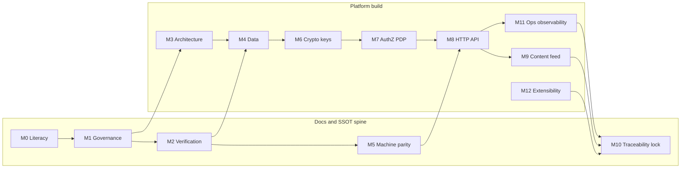

# CRE8 platform implementation milestones & slices (SSOT-guided)

_Last updated (UTC): 2026-05-05_

## Purpose & location

This is the primary **engineering delivery roadmap** for the platform: phased milestones (**M0**–**M12**) and workable **slices**. It belongs under **`dev/`** alongside other developer-facing planning artifacts. It is keyed to **`dev/SSOT_CANON_READING_LIST.md`**, governance and traceability slice concepts in **`docs/80_traceability_decisions_and_program/ROADMAP_AND_MILESTONES.md`**, **`docs/60_operations_quality_and_release/RELEASE_CHECKLIST.md`** gates (RG-01..RG-05), and **ADR-006** (Phase 4 program-lock posture—legacy Phase 1 freeze waivers must not be used as generic deferrals).

Normative requirements remain in **`docs/`**; this file is **development planning**, not product SSOT.

**Note:** Milestones are outcomes; slices are contiguous work units suited to “2–5 batch” authoring or implementation sessions.

Relocation record (informational): [`reports/IMPLEMENTATION_MILESTONES_DEV_RELOCATION_NOTE_2026-05-05.md`](../reports/IMPLEMENTATION_MILESTONES_DEV_RELOCATION_NOTE_2026-05-05.md).

---

## Program topology (dependency order)

### Recommended hard gates

1. **M1** complete before sustained normative changes without formal change discipline.
2. **M3** middleware/pipeline contracts fixed before widening route implementations (handlers must not branch on PDP outcomes per **`docs/10_product_and_architecture/REQUEST_PIPELINE_AND_MIDDLEWARE_CONTRACT.md`**).
3. **M7** PDP semantics stable before declaring broad route inventory “complete”.
4. **M5** route/schema parity baseline green before **M8** sign-off (“API-complete”).
5. **M10** is organizational program lock—traceability closure + **`composer phase3:final-acceptance-bundle`** and CI assertions (e.g. `untraced_requirements == 0`).

---

## Milestones (outcomes)

| ID | Milestone | Outcome |
|----|-----------|---------|
| **M0** | Canon literacy & local SSOT toolchain | Team navigates README → docs → **`docs/00_governance/SSOT_INDEX.md`**, runs Composer SSOT scripts, classifies PR change class |
| **M1** | Governance / change spine | CONTRIBUTION_WORKFLOW_SSOT / CHANGE_CONTROL / DEFINITION_OF_DONE / linking policy enforced; metadata headers on normative edits |
| **M2** | Verification backbone | TRACEABILITY_MATRIX, VERIFICATION_STRATEGY, SSOT_AUTOMATION_AND_LINTING understood; CI **`docs:ssot:*`** posture non-negotiable |
| **M3** | Architectural runtime spine | Slim/php-di posture per DEPENDENCY_BASELINE; SURFACES + REQUEST_PIPELINE + envelope centralization |
| **M4** | Data plane | DATA_MODEL_* / ERD ↔ migrations; seed gating per MIGRATION_AND_SEED_STRATEGY |
| **M5** | Machine-contract substrate | ROUTE inventory ↔ OpenAPI ↔ JSON schemas ↔ **`PROSE_OPENAPI_PARITY_TABLE`**; CONTRACT_VERSION_POLICY |
| **M6** | Crypto & key lifecycle | CRYPTO_PROFILE + KEY_LIFECYCLE_* operational; SECURITY_HEADERS_AND_CSP on HTTP surfaces |
| **M7** | Identity, PDP, delegation, keychain | Principal taxonomy, PERMISSION_VOCABULARY, seven-gate PDP + precedence; delegation SM; KEYCHAIN ordering |
| **M8** | HTTP API breadth | ROUTE inventory behaviors, envelopes, ERROR_CODE_CATALOG; examples ↔ tests |
| **M9** | Content / audience / feed / interactions | CONTENT_MODEL, AUDIENCE_GROUP, FEED_RANKING determinism; COMMENTING_POLICY ↔ AUTH denies |
| **M10** | Traceability, evidence & program lock | Requirement ↔ hook ↔ evidence closure; decisions/risks/seed trackers consistent with ADR-006 |
| **M11** | Operations / release | HEALTH, BOOT, CONFIG, SMOKE; OBSERVABILITY_EVENT_CATALOG; RELEASE_CHECKLIST + PRODUCTION_READINESS_GATES + SLO/SLI |
| **M12** | Extensibility & integrations | MODULE_BOUNDARIES / EXTENSIBILITY_PLAYBOOK / INTEGRATION_PROVIDER_PATTERN / WEBHOOK_AND_INTEGRATION |

---

## Slices per milestone

Each slice summarizes: objective, entry prerequisites, exit criteria, primary canon anchors (reading-list grouping), Composer/CI-oriented verification hooks.

### M0 — Canon literacy & toolchain

| Slice ID | Objective | Entry | Exit | Canon anchors | Verification hooks |
|----------|-----------|--------|-----|---------------|--------------------|
| S0.1 | Repository precedence | Clone + README | Explicit note: precedence README → docs/ → reports/; seed = provenance | Reading list §1 | `composer validate --strict` |
| S0.2 | Governance path | S0.1 | Path to governance set documented | §2 | `composer docs:ssot:lint` |
| S0.3 | SSOT toolchain rehearsal | S0.2 | Local run of workflows’ SSOT Composer targets | §13 | `docs:ssot:*` + `composer.json` parity |
| S0.4 | WG RACI-lite | S0.2 | Review/classification owners per DOCUMENT_STATUS_AND_OWNERSHIP | §2–3 | N/A |

### M1 — Governance / change

| Slice ID | Objective | Entry | Exit | Canon anchors | Hooks |
|----------|-----------|--------|-----|---------------|-------|
| S1.1 | PR change class | M0 | Template checklist (contract-/security-/governance-/editorial) | CONTRIBUTION_WORKFLOW; CHANGE_CONTROL | `docs:ssot:pr-evidence-check` |
| S1.2 | Metadata & style | M0 | Pilot doc audited for DOCUMENT_TEMPLATE_AND_STYLE_GUIDE headers | STYLE GUIDE | `docs:ssot:lint` |
| S1.3 | Reachability | S1.2 | SSOT_INDEX linkage / no orphaned normative hubs | SSOT_INDEX; CROSS_DOCUMENT_LINKING | link + route tooling as configured |

### M2 — Verification

| Slice ID | Objective | Entry | Exit | Canon anchors | Hooks |
|----------|-----------|--------|-----|---------------|-------|
| S2.1 | Trace mechanics | M1 | Team adds matrix rows REQ ↔ HOOK ↔ mode ↔ evidence | TRACEABILITY_MATRIX; VERIFICATION_STRATEGY | `docs:ssot:report`, coverage artifact |
| S2.2 | Hook registry | S2.1 | New reqs ship with Composer mapping | SSOT_AUTOMATION_AND_LINTING | CI phase gate suite |
| S2.3 | Phase 2 bundle | Harness ready | Phase 2 acceptance green | PHASE2_ACCEPTANCE_CRITERIA; PHASE2_EXCEPTIONS | `composer phase2:acceptance-bundle` |
| S2.4 | Phase 3 bundle | Commands available | RG-04 precondition met on branch | RELEASE_CHECKLIST | `composer phase3:final-acceptance-bundle` |

### M3 — Architecture / pipeline

| Slice ID | Objective | Entry | Exit | Canon anchors | Hooks |
|----------|-----------|--------|-----|---------------|-------|
| S3.1 | Composition root | M2 | php-di MODULE_BOUNDARIES compliance | DEPENDENCY_BASELINE; MODULE_BOUNDARIES | lint + smoke |
| S3.2 | Middleware order | S3.1 | Central envelope; no PDP branching in handlers | REQUEST_PIPELINE_AND_MIDDLEWARE; SURFACES | contract tests |
| S3.3 | Surface topology | S3.2 | Route groups mapped to documented surfaces | ARCHITECTURE_AND_SURFACES | route inventory prelude |

### M4 — Data

| Slice ID | Objective | Entry | Exit | Canon anchors | Hooks |
|----------|-----------|--------|-----|---------------|-------|
| S4.1 | Entities & enums | M4 | SCHEMA matches DATA_MODEL_* / FK rules | §7 DATA_MODEL_*; ERD | migration tests |
| S4.2 | Seeds | S4.1 | baseline/test/demo gating per strategy | MIGRATION_AND_SEED_STRATEGY | env-gated seeds |

### M5 — Machine contracts

| Slice ID | Objective | Entry | Exit | Canon anchors | Hooks |
|----------|-----------|--------|-----|---------------|-------|
| S5.1 | ROUTE_OPENAPI parity | M3 | Full inventory parity | ROUTE_INVENTORY_REFERENCE; openapi; PARITY_TABLE | `docs:ssot:route-parity` |
| S5.2 | Envelope schemas | S5.1 | Payloads validated vs schemas/guides | schemas; API_CONTRACT_GUIDE | tests / CI |
| S5.3 | Version policy | S5.2 | CONTRACT_VERSION semver triggers explicit | CONTRACT_VERSION_POLICY | contracts |

### M6 — Crypto / security transport

| Slice ID | Objective | Entry | Exit | Canon anchors | Hooks |
|----------|-----------|--------|-----|---------------|-------|
| S6.1 | Crypto profile | M4 crypto touchpoints | CRYPTO_PROFILE invariants live | §7 crypto | SECURITY_VERIFICATION_* |
| S6.2 | Key lifecycle | S6.1 | States + rotations; forbidden utility widen | KEY_LIFECYCLE_* | integration tests |
| S6.3 | HTTP headers | transport | SECURITY_HEADERS_* applied | SECURITY_HEADERS_AND_CSP | header tests |

### M7 — Identity / authorization

| Slice ID | Objective | Entry | Exit | Canon anchors | Hooks |
|----------|-----------|--------|-----|---------------|-------|
| S7.1 | Principals / permissions | M6 | taxonomy + UNKNOWN deny | PRINCIPAL_TYPES; PERMISSION_VOCABULARY | `test:contract:identity-*` |
| S7.2 | Auth proofs | S7.1 | auth_models per ROUTE_INV | ROUTE_INV; AUTHORIZATION_* | auth contracts |
| S7.3 | PDP gates | S7.2 | 7 gates + precedence; ADR-005 alignment | AUTHORIZATION_*; TABLES | POLICY/order hooks |
| S7.4 | Keychain | S7.3 | deterministic grant order | KEYCHAIN_* | targeted tests |
| S7.5 | Delegation SM | S7.4 | cascade / blocked semantics | DELEGATION_STATE_MACHINE; scenarios | lifecycle contracts |

### M8 — API surface clusters

| Slice ID | Objective | Entry | Exit | Canon anchors | Hooks |
|----------|-----------|--------|-----|---------------|-------|
| S8.1 | Auth routes | M7 | family complete + denies | ROUTE_INV; ERROR_CODE_CATALOG | `test:contract:auth` |
| S8.2 | Issuance/context | S8.1 | schema parity | openapi + schemas | identity issuance/context suites |
| S8.3 | Lifecycle routes | S8.2 | suspend/revoke | lifecycle schemas | `test:contract:lifecycle` |
| S8.4 | Feed routes | prerequisites | FEED_RANKING deterministic | FEED_RANKING_* | `test:contract:feed` |
| S8.5 | Examples sweep | clusters | Endpoint_Examples coverage | Endpoint_Examples_All_Routes | per-route negatives |
| S8.6 | UI/runtime parity | S8.* | EXCEPTION_CLASS bounded | UI_RUNTIME_CONTRACT | `test:contract:surface-parity` |

### M9 — Content / audience / interactions

| Slice ID | Objective | Entry | Exit | Canon anchors | Hooks |
|----------|-----------|--------|-----|---------------|-------|
| S9.1 | Audience groups | M4 | audience.group permissions | AUDIENCE_GROUP_SPEC | integrations |
| S9.2 | Targeting | S9.1 | visibility_scope | CONTENT_MODEL_* | targeting tests |
| S9.3 | Comments/interactions | S9.2 | moderator + deny codes | COMMENTING_POLICY | feed/interaction suites |

### M11 — Ops / observability / release

| Slice ID | Objective | Entry | Exit | Canon anchors | Hooks |
|----------|-----------|--------|-----|---------------|-------|
| S11.1 | Health & boot | M3 | READY vs LIVE semantics | HEALTH_*; BOOT_* | smoke |
| S11.2 | Configuration | M3 | env policy + secrets | CONFIGURATION_* | validation tests |
| S11.3 | Observability | routes emit outcomes | mandated catalog entries | OBSERVABILITY_EVENT_CATALOG | log/trace checks |
| S11.4 | RG evidence | nearing lock | RG-01..RG-05 fields | RELEASE_*; ACCEPTANCE_MATRIX | Composer bundles |

### M12 — Extensibility / integrations

| Slice ID | Objective | Entry | Exit | Canon anchors | Hooks |
|----------|-----------|--------|-----|---------------|-------|
| S12.1 | Extension pilot | M7/M8 | no PDP shortcut | EXTENSIBILITY_PLAYBOOK; MODULE_BOUNDARIES | regression |
| S12.2 | Outbound provider | integrations | outbound ladder | INTEGRATION_PROVIDER_PATTERN | retries |
| S12.3 | Webhook inbound | S12.2 | verify → replay → schema | WEBHOOK_AND_INTEGRATION | inbound harness |

### M10 — Program lock / traceability

| Slice ID | Objective | Entry | Exit | Canon anchors | Hooks |
|----------|-----------|--------|-----|---------------|-------|
| S10.1 | Corpus reconcile | Parallel progress | Seeds/gaps triaged | UNRESOLVED_SEED_GAP_REGISTER; SEED_PROMOTION | `docs:ssot:sync-check` |
| S10.2 | Matrix closure | S10.1 | untraced requirements zero | TRACEABILITY_MATRIX | CI coverage |
| S10.3 | Decisions/risks | ADR-006 | ADR supersedence + risks | ADR_INDEX; RISK_REGISTER | governance review |
| S10.4 | Evidence index | S10.2 | evidence templates RG-ready | docs/evidence | RG-05 readiness |

---

## Relation to Phase 4 document-completion program

Canonical doc-completion sequencing lives in **`reports/PHASE4_CANON_COMPLETION_MILESTONES.md`** (M1–M8 / P4-S*). Map as follows:

- Phase 4 **normative prose hardening** supports **S2.x/S10.x** documentation closure.
- Phase 4 **identity/contract/security** slices align prerequisite docs for **S5–S8 / S7 / S6**.
- Phase 4 **traceability-lock** aligns with **M10 / S10.x**.

Treat Phase 4 as nested **documentation-completion** lanes that close **ahead of or alongside** runtime milestones—not a substitute for **M3–M9** engineering delivery.

---

## See also

- [`SSOT_CANON_READING_LIST.md`](./SSOT_CANON_READING_LIST.md)
- [`README.md`](./README.md) (development workspace index under `dev/`)
- [`../reports/PHASE4_CANON_COMPLETION_MILESTONES.md`](../reports/PHASE4_CANON_COMPLETION_MILESTONES.md)
- [`../REFERENCE_MAINTENANCE_SOP.md`](../REFERENCE_MAINTENANCE_SOP.md)
