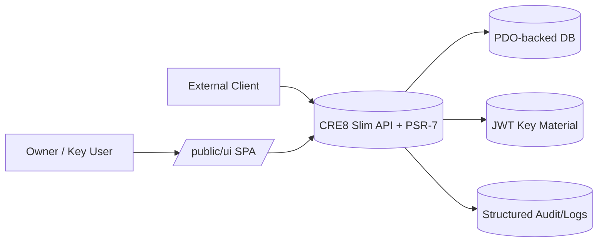
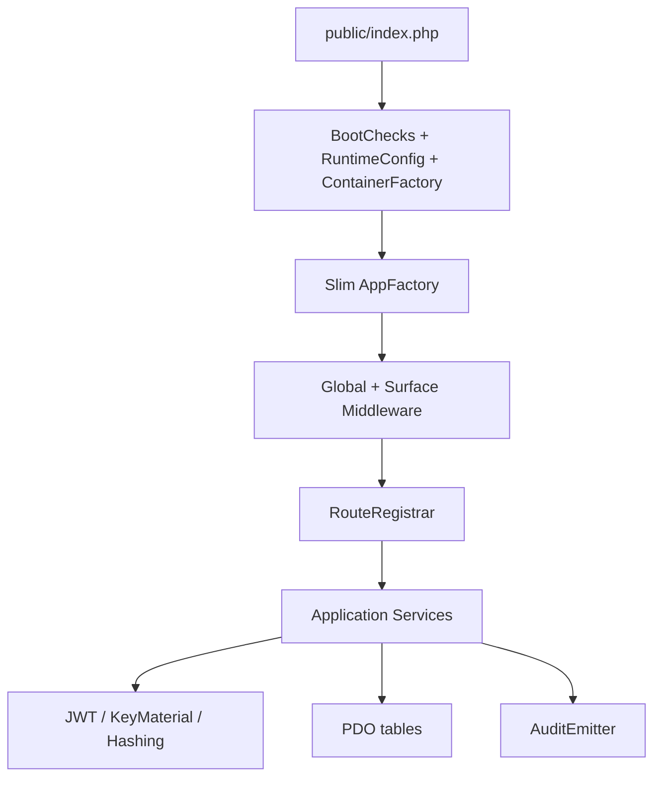
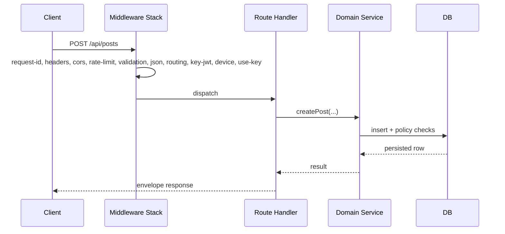
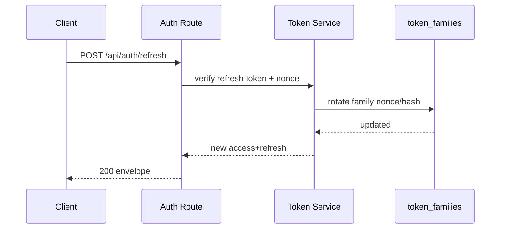
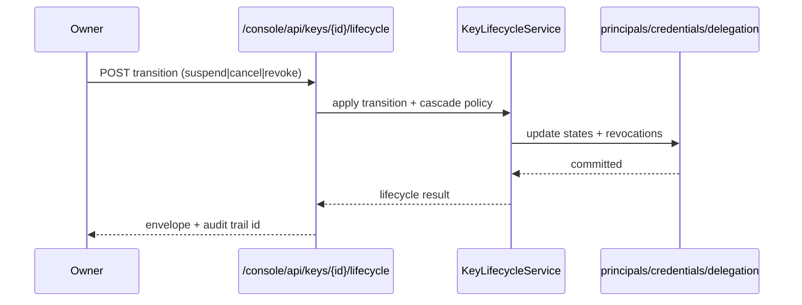

# Architecture Diagrams

_Status: adopted_
_Last updated (UTC): 2026-04-06_

Canonical terminology: `Canonical_Terminology_Dictionary.md`

## 1) C4-style Context Diagram

## 2) Component Diagram

## 3) Request Sequence (gateway write)

## 4) Token refresh sequence

## 5) Key lifecycle sequence

