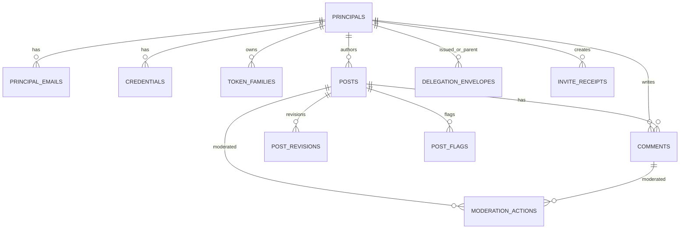

# ERD (Text + Mermaid)

_Status: adopted_
_Last updated (UTC): 2026-04-06_

## Notes
- Delegation lineage is represented by `DELEGATION_ENVELOPES.parent_key_id` and `initial_author_key_id`.
- Refresh/replay protection is represented by `TOKEN_FAMILIES`.
- Keychains are extension-scoped and not included in the required v1 ERD.
