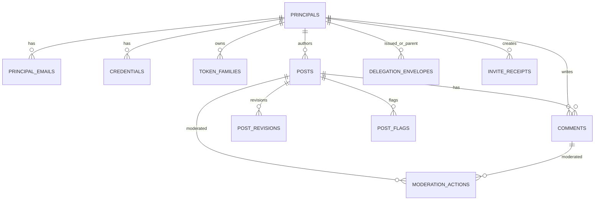

# ERD (Text + Mermaid)

_Last updated (UTC): 2026-04-06_

## Notes
- `delegation_envelopes` links parent and child credentials for lineage.
- Moderation actions capture governance transitions for both posts and comments.
